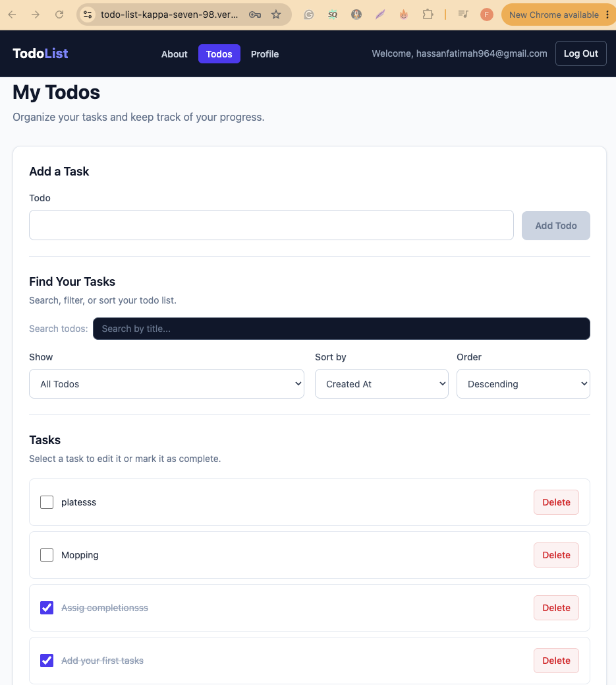
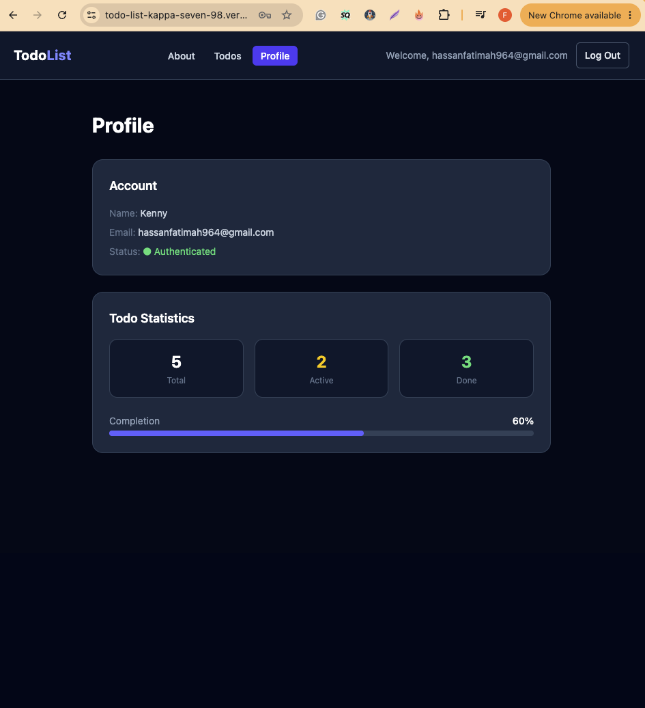
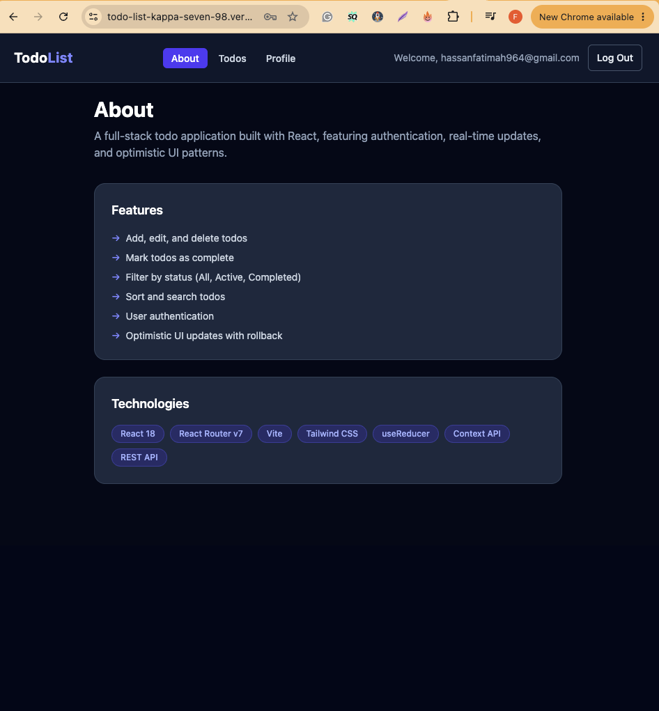

# TodoList

A responsive task management application built with React that allows authenticated users to organize, manage, search, filter, and track their todos through a clean and accessible interface.

## Live Demo

[View the live TodoList application](https://todo-list-kappa-seven-98.vercel.app)
## Overview

TodoList is a full-featured task management application developed as part of the Code the Dream React curriculum. The project brings together component-based React development, authentication, protected routing, API integration, state management, responsive design, accessibility, security considerations, and production deployment.

The application allows users to authenticate, create and manage todos, search and organize tasks, and monitor completion progress from a dedicated profile dashboard.

## Features

### Authentication and Access Control

- User login and logout
- Protected application routes
- Authentication-aware navigation
- CSRF token handling for protected API operations
- Cookie-based server session support

### Todo Management

- Create new todos
- View existing todos
- Edit todo titles
- Mark todos as completed
- Delete todos
- Optimistic UI updates
- Loading, error, and empty states

### Search, Filtering, and Sorting

- Search todos by title
- Debounced search input
- Filter by task status
- Sort todos using supported fields
- Control ascending and descending order
- URL-based status filtering

### User Profile

- Display authenticated account information
- Show total, active, and completed todo counts
- Calculate task completion percentage
- Visual completion progress indicator

### Routing and Navigation

- Client-side routing with React Router
- Protected Todo and Profile routes
- Dedicated About page
- Custom 404 page
- SPA routing support for direct URLs and browser refreshes

### Responsive Interface

- Responsive page layouts
- Consistent navigation and application branding
- Clear form and task-management controls
- Visible keyboard focus states
- Accessible form labels
- Screen-reader support for relevant controls

## Technologies

| Technology | Purpose |
| --- | --- |
| React | Component-based user interface |
| Vite | Development server and production build tooling |
| React Router | Client-side routing and protected navigation |
| JavaScript | Application logic |
| Tailwind CSS | Responsive styling and visual design |
| Fetch API | Communication with the backend API |
| Vercel | Frontend deployment and production routing |
| Git and GitHub | Version control and project collaboration |

## Application Architecture

The application follows a component-based React architecture with responsibilities separated across pages, reusable components, authentication context, custom hooks, reducers, shared utilities, and feature-specific code.

Authentication state is managed through an `AuthProvider` and consumed through a custom `useAuth` hook. Todo state and API operations are handled separately from authentication concerns, helping keep the application easier to understand and maintain.

A simplified structure of the application is:

src/
├── assets/
├── components/
├── contexts/
├── features/
├── hooks/
├── pages/
├── reducers/
├── shared/
├── utils/
├── App.jsx
├── index.css
└── main.jsx

## Authentication

Authentication is handled through the application's backend API.

After a successful login, the application receives the authenticated user's information and a CSRF token. The authentication context makes this state available to protected parts of the application.

Requests that depend on the server session use:

credentials: "include"

Protected API mutations also send the CSRF token using the `X-CSRF-TOKEN` request header.

Authentication state such as the CSRF token is not intentionally persisted in browser `localStorage`.

## API Integration

During local development, Vite proxies requests beginning with `/api` to the configured backend service.

The frontend can therefore make requests using relative paths such as:

/api/users/logon
/api/users/logoff
/api/tasks

In the deployed application, Vercel rewrites `/api/*` requests to the backend service. This preserves a consistent API interface between local development and deployment without hard-coding different API URLs throughout the React components.

## Security

Security was considered throughout both application development and deployment.

Key practices include:

- CSRF protection for authenticated API mutations
- Cookie-based server sessions
- `credentials: "include"` for requests requiring the authenticated session
- No passwords or authentication credentials stored in application source code
- Environment-specific configuration kept outside application logic
- `.env` files excluded from source control
- CSRF tokens not intentionally persisted in `localStorage`
- React's normal rendering model used rather than injecting untrusted HTML
- Protected client-side routes for authenticated application areas
- API proxying to avoid exposing unnecessary environment-specific logic throughout the frontend
- Production routing configuration maintained separately from sensitive environment variables

The repository's `vercel.json` contains deployment and routing configuration rather than application secrets and is therefore intentionally version controlled.

## Deployment

The application is deployed with Vercel.

Production builds are generated using:

npm run build

Vite outputs the optimized application to the `dist` directory.

A root-level `vercel.json` configures production routing. API requests are rewritten to the backend service, while other application routes fall back to `index.html` so React Router can handle direct navigation and browser refreshes.

This allows routes such as `/about`, `/todos`, `/profile`, and the custom 404 route to function correctly in the deployed single-page application.

## Local Development

### Prerequisites

Before running the project locally, install:

- Node.js
- npm
- Git

### Installation

Clone the repository:

```bash
git clone https://github.com/Fatimah1403/todo-list.git
```

Move into the project directory:

```bash
cd todo-list
```

Install dependencies:

```bash
npm install
```

Create the required local environment configuration based on the backend environment used for development.

Start the development server:

```bash
npm run dev
```

The application is configured to run locally through Vite.

## Available Scripts

### `npm run dev`

Starts the Vite development server.

```bash
npm run dev
```

### `npm run build`

Creates an optimized production build.

```bash
npm run build
```

### `npm run lint`

Runs ESLint to identify code-quality and consistency issues.

```bash
npm run lint
```

### `npm run preview`

Locally previews the production build generated by Vite.

```bash
npm run preview
```

Creates an optimized production build.

### `npm run lint`

Runs ESLint to identify code-quality and consistency issues.


## Code Quality

The project emphasizes maintainability through:

- Reusable React components
- Clear separation between authentication and application features
- Custom hooks for shared React behavior
- Reducer-based todo state management
- Consistent naming and project organization
- Centralized authentication context
- Loading and error handling for asynchronous operations
- ESLint-based static analysis
- Production build verification before deployment

## Accessibility

Accessibility considerations include semantic form controls, associated labels, keyboard-accessible actions, visible focus states, descriptive navigation, and screen-reader text where visual controls alone may not provide sufficient context.

The interface also uses clear status and error feedback rather than relying solely on visual layout changes.

## Challenges and Solutions

### Production API Routing

The application uses relative `/api` URLs during development. A production deployment cannot rely on Vite's development proxy, so Vercel rewrite rules were added to proxy API requests to the backend while keeping the frontend API interface unchanged.

### Single-Page Application Routing

Client-side routes work naturally while navigating inside React, but directly opening or refreshing a nested route requires server-side fallback behavior. A Vercel rewrite sends application routes to `index.html`, allowing React Router to resolve the requested page.

### Authentication State

Authentication data is maintained through React context while the server manages the underlying session. Sensitive authentication state is not intentionally persisted in browser `localStorage`. A full browser reload therefore resets in-memory React authentication state and requires the user to authenticate again.

### Managing Todo State

Todo operations involve asynchronous backend requests while maintaining a responsive interface. Reducer-based state management and optimistic updates help keep UI behavior predictable while providing appropriate error handling when API operations fail.

## Future Enhancements

Potential improvements include:

- Server-supported authentication-session restoration after browser refresh
- Additional task metadata such as due dates and priorities
- Task categories or tags
- Expanded user preferences
- Additional accessibility testing
- Automated component and integration tests
- Enhanced progress and productivity analytics


## Screenshots

### Todo Management

The main dashboard provides todo creation, search, filtering, sorting, completion tracking, editing, and deletion in a responsive interface.



### Profile and Progress Tracking

The profile dashboard presents authenticated account information together with real-time todo statistics and overall completion progress.



### Application Overview

The About page summarizes the application's core functionality and the technologies used to build it.



## Project Context

This project was developed as part of the Code the Dream React curriculum and represents the progression from foundational React concepts to a complete deployed application.

The final application demonstrates component design, state management, API communication, authentication, routing, responsive styling, security awareness, debugging, Git-based development, and production deployment.

## Author

Fatimah Hassan

Software developer with interests in full-stack development, mobile development, machine learning, and applied AI.